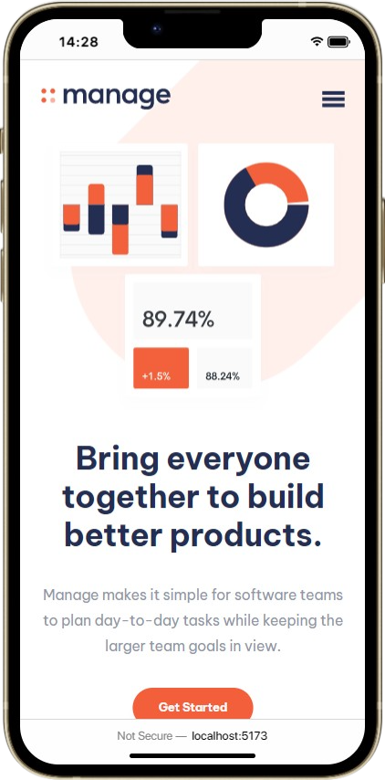
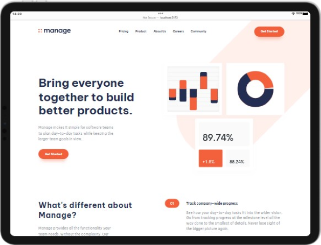
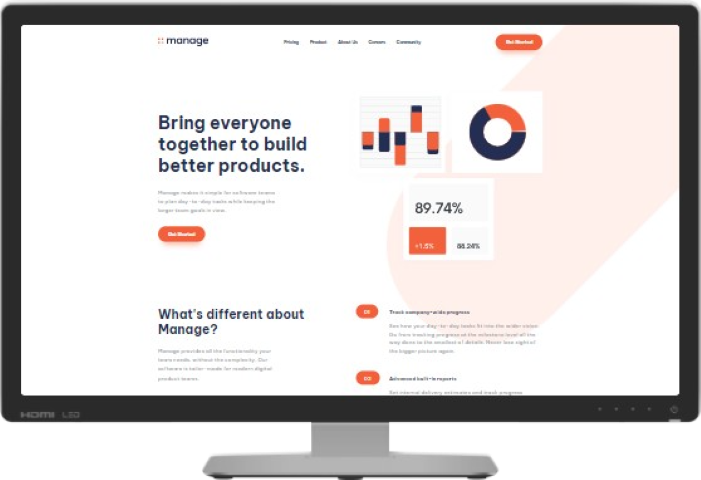

<h1 align="center"> Manage Landing Page </h1>
<h2 align="center"><a href="https://frontendmentor.io/">FEM</a>&nbsp;Challenge</h2>

### What's this? 🤔

The Manage Landing Page is a [FEM](https://frontendmentor.io) challenge that gave me a firm grasp on _relatively_ complex layouts. It seems to be very consistent thanks to its color palette but there are small things like margin and paddings varying a lot across the whole page.

Extra utility classes would have come in handy, but overall it was a fun project to build.

### Tools used 🧰

- [NodeJS](https://nodejs.org/)
- [Vite](https://vitejs.dev/)
- [React](https://reactjs.org/)
- [Framer Motion](https://www.framer.com/motion/)
- [PostCSS](https://postcss.org/)
- [Firefox](https://www.mozilla.org/en-US/firefox/)
- [Visual Studio Code](https://code.visualstudio.com/)

### [Live preview 🎨](https://manage-lp-rwxdan.vercel.app/)

|  |  |  |
| ----------------------------------------- | ----------------------------------------- | ------------------------------------------ |
